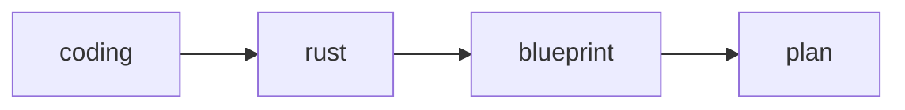

# Qianji Flowhub

Qianji Flowhub is a registry of graph nodes anchored by `qianji.toml`.

The live Flowhub root is governed by its own [`qianji.toml`](qianji.toml). The
root `[contract]` declares:

- which top-level graph-node directories are registered
- which required filesystem surfaces must exist under those registered nodes

`qianji check --dir "$PRJ_ROOT/qianji-flowhub"` is therefore a contract
evaluation, not a heuristic directory scan.

## Node Contract

Every live Flowhub node is anchored by a module-root `qianji.toml`:

```text
<node>/
  qianji.toml
```

- `qianji.toml` is the public node contract.
- leaf nodes may contain only that anchor manifest.
- if a node needs owned child directories, it must declare them explicitly in
  `[contract]`.
- if a child directory is not declared by `[contract]`, `qianji check` must
  treat it as structural drift.

The live Flowhub root does not carry checked-in `template/` or `validation/`
subdirectories. Those remain test-only fixture surfaces, not part of the live
library contract.

## Active Demo Tree

The current live tree is:

```text
qianji-flowhub/
  qianji.toml
  coding/
    qianji.toml
  rust/
    qianji.toml
  blueprint/
    qianji.toml
  plan/
    qianji.toml
    codex-plan.mmd
```

The intended graph backbone is:



Flowhub stores node anchors. Specific scenario relations are composed by
scenario manifests and materialized work surfaces, not by nesting unrelated
graph nodes inside one directory tree.

Immediate `*.mmd` files under a node are scenario-case graphs owned by that
node. They must be declared by the node's `[contract].required` entries.

For the live `plan` node:

```text
plan/
  qianji.toml
  codex-plan.mmd
```

`codex-plan.mmd` is a Mermaid scenario-case graph. `qianji check` parses it
through `merman-core`, derives `merimind_graph_name` from the filename stem,
classifies labels matching live Flowhub module names as graph-module nodes,
and rejects malformed or uncontracted scenario-case files. The graph must
cover every registered Flowhub module node required by the current root
contract, keep one connected module backbone between those module nodes, and
avoid undeclared graph-node labels. `qianji show --dir "$PRJ_ROOT/qianji-flowhub/plan"`
renders the owned scenario case with explicit fields for `Graph name` and
`Path`.

## Scenario Composition Example

```toml
version = 1

[planning]
name = "coding-rust-blueprint-plan-demo"
tags = ["planning", "coding", "rust", "demo"]

[template]
use = [
  "coding as coding",
  "rust as rust",
  "blueprint as blueprint",
  "plan as plan",
]

[[template.link]]
from = "coding::task.coding-ready"
to = "rust::task.rust-start"

[[template.link]]
from = "rust::task.constraints-ready"
to = "blueprint::task.blueprint-start"

[[template.link]]
from = "blueprint::task.blueprint-ready"
to = "plan::task.plan-start"
```

This matches the scenario fixture at
`packages/rust/crates/xiuxian-qianji/tests/fixtures/flowhub/coding_rust_blueprint_plan/qianji.toml`
in the parent workspace.

## Validation Anchor

Flowhub layout validation is anchored in `qianji.toml`.

For the live Flowhub root:

```sh
direnv exec "$PRJ_ROOT" cargo run -p xiuxian-qianji --features llm --bin qianji -- \
  show \
  --dir "$PRJ_ROOT/qianji-flowhub"

direnv exec "$PRJ_ROOT" cargo run -p xiuxian-qianji --features llm --bin qianji -- \
  check \
  --dir "$PRJ_ROOT/qianji-flowhub"
```

For one node:

```sh
direnv exec "$PRJ_ROOT" cargo run -p xiuxian-qianji --features llm --bin qianji -- \
  check \
  --dir "$PRJ_ROOT/qianji-flowhub/rust"

direnv exec "$PRJ_ROOT" cargo run -p xiuxian-qianji --features llm --bin qianji -- \
  show \
  --dir "$PRJ_ROOT/qianji-flowhub/plan"
```

The validation model is:

1. the Flowhub root is anchored by `qianji-flowhub/qianji.toml`
2. `[contract].register` defines the allowed child graph-node directories
3. `[contract].required` defines the required filesystem surfaces for those
   nodes
4. individual nodes may declare their own `[contract]` only when they really
   own child graph-node directories or immediate local scenario-case files
5. immediate `*.mmd` scenario-case files must be declared in
   `contract.required`
6. `qianji check` evaluates those contracts and reports structural drift with
   markdown diagnostics
